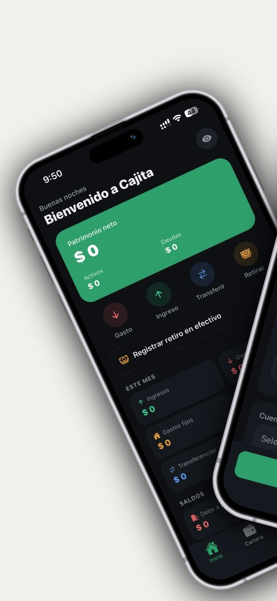
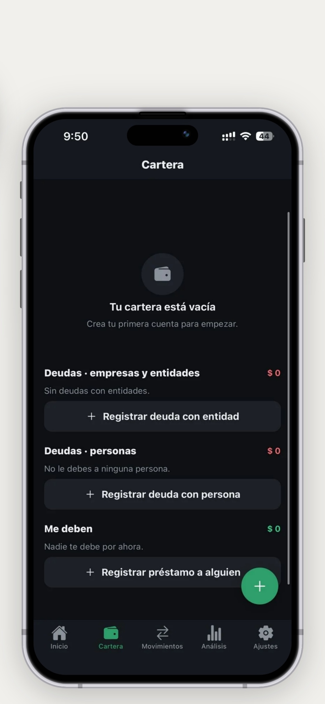
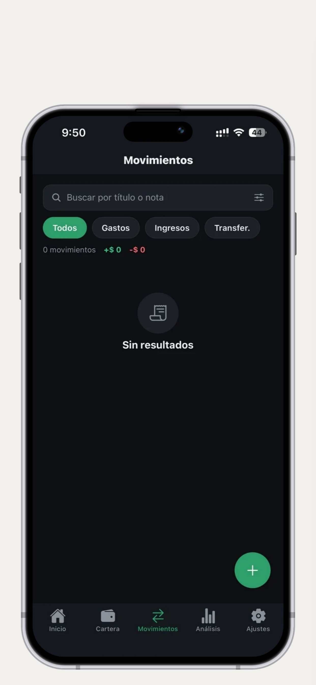
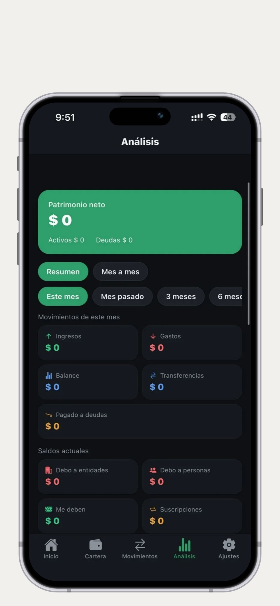
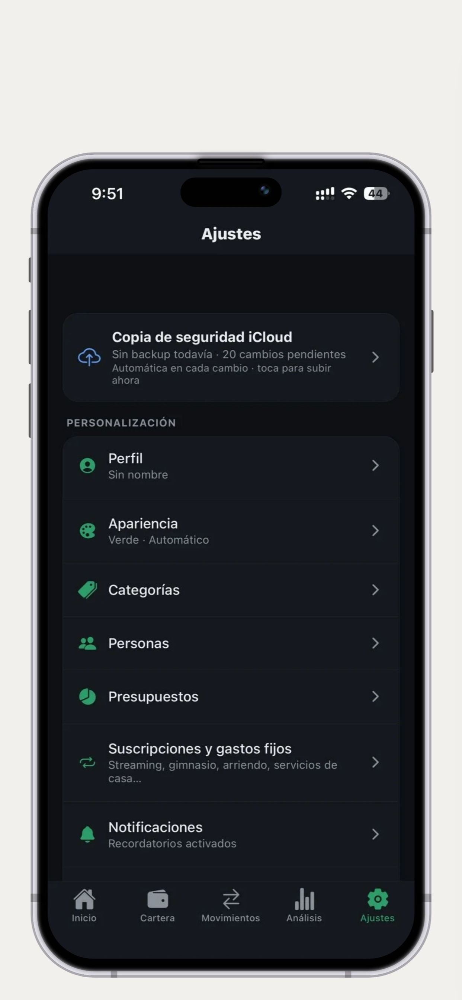

# 💚 Cajita

Finanzas personales **local-first** para iOS. Tus datos viven cifrados en tu dispositivo y se sincronizan con tu iCloud. Sin servidores, sin anuncios, sin trackers.

Gestiona tus cuentas, tarjetas de crédito, deudas, préstamos, gastos fijos y retiros de efectivo con un flujo contable correcto — una alternativa moderna y privada a Flow, Cashew y Dime.

TypeScript React Native Expo SQLCipher CloudKit Bundle

---

## 📱 Preview

|                         |                         |                         |
| ----------------------- | ----------------------- | ----------------------- |
|  |  |  |
|  |  |  |

---

## ✨ Features

- **Múltiples cuentas**: Banco, Efectivo, Ahorro, Cajita, Tarjeta de crédito (con cupo), CDT y Deuda
- **Saldo en tiempo real** por cuenta, color e ícono personalizados
- **Gasto / Ingreso / Transferencia / Balance Correction**: las transferencias entre cuentas no cuentan como gasto ni ingreso
- **Pago de tarjeta → reduce la deuda**: transferencia desde tu cuenta de fondos que baja el saldo de la tarjeta
- **Préstamos bidireccionales**: «Debo» (borrowed) y «Presté» (lent), con cuotas que reducen el saldo pendiente e intereses/costos (TotalOffset)
- **Personas**: ficha con teléfono, correo, identificación y notas; préstamos vinculados a cada persona
- **Gastos fijos y servicios**: checklist mensual (pendiente / pagado / omitido / vencido) con monto estimado y día de pago
- **Suscripciones**: parametrizables con frecuencia, antelación de aviso y recordatorios locales (N días antes + el día anterior + el mismo día)
- **Retiros de efectivo**: «retiré $X» y la app descuenta automáticamente los gastos en efectivo; sobrante al cerrar el mes
- **Estadísticas**: patrimonio neto, ingresos/gastos del mes, desglose por categoría, series mensuales y presupuestos
- **Importación CSV**: formato extendido con cuentas, cupos, transferencias, préstamos y personas; descarga de plantilla incluida
- **Exportación**: movimientos (CSV) y backup completo (JSON)
- **Dark / Light mode**: tema claro, oscuro y automático, con 10 colores de acento
- **Bloqueo con biometría**: Face ID / Touch ID / huella al abrir y al volver de segundo plano

---

## 🛠️ Technology Stack

| Layer         | Technology                                                   |
| ------------- | ------------------------------------------------------------ |
| Framework     | React Native + Expo SDK 57                                   |
| Language      | TypeScript (estricto)                                        |
| Navigation    | expo-router                                                  |
| Database      | expo-sqlite + **SQLCipher** (SQLite cifrado AES-256)         |
| Sync / Backup | CloudKit / iCloud (`NSUbiquitousContainers` + módulo nativo) |
| Security      | expo-local-authentication · expo-secure-store · expo-crypto  |
| Notifications | expo-notifications (recordatorios locales)                   |
| Charts        | SVG/gráficos propios (`Charts.tsx`)                          |
| CI/CD         | Codemagic (`codemagic.yaml`) — build iOS/Android en la nube  |
| Build         | esbuild / Metro Bundler                                      |

---

## 🚀 Installation

### From source

```bash
git clone https://github.com/TheOfYisu/Cajita.git
cd cajita
npm install
```

### Dev build (necesario)

> ⚠️ **Expo Go ya no es compatible.** La app usa SQLCipher (módulo nativo), así que necesita un **dev build**.

- **Android (Windows):** `npx expo run:android` con un emulador o dispositivo conectado.
- **iOS:** genera un dev build en Codemagic/EAS (`ios_signing.distribution_type: development`), instálalo en el dispositivo y luego `npx expo start --dev-client`.
- **Web (solo pruebas de UI):** `npx expo start --web` — en web no hay cifrado ni módulos nativos.

---

## 🧑‍💻 Development

```bash
npm run dev      # dev build con expo start --dev-client
npm run web      # expo start --web
npm run build    # expo prebuild (genera ios/ y android/)
npm run lint     # expo lint
```

### Build para iOS / Android (desde Windows)

El desarrollo es en Windows, así que la compilación nativa corre en la nube.

**Codemagic (recomendado) — `codemagic.yaml`**

El repo trae `codemagic.yaml` con dos workflows (`ios-release`, `android-release`) que generan los proyectos nativos en CI con `npx expo prebuild`. Se disparan al crear un tag `v*`:

```bash
git tag v1.0.8 && git push origin v1.0.8
```

**EAS Build (alternativa)**

```bash
npx eas-cli login
npx eas-cli build --platform ios
```

> La configuración de iCloud ya está en `app.json` (`NSUbiquitousContainers` + entitlements vía `plugins/withCajitaEntitlements.js`). El App ID `com.cajita.app` debe tener la capacidad **iCloud** habilitada en Apple Developer con el contenedor `iCloud.com.cajita.app`. El entitlement de Key-Value Storage usa `$(TeamIdentifierPrefix)$(CFBundleIdentifier)` para coincidir con el provisioning profile.

---

## 📖 Usage

### Cuentas

Crea cuentas de cualquier tipo, define cupo en tarjetas, marca una **cuenta principal**, configura vencimiento y rendimiento en CDTs, y archiva cuentas que ya no uses.

### Transacciones

Registra gastos, ingresos y transferencias. El **pago de tarjeta / crédito** se hace como transferencia desde tu cuenta de fondos: el dinero sale de la cuenta **y** reduce la deuda, sin distorsionar tus reportes de gasto.

### Gastos fijos y servicios

Parametriza arriendo, administración, agua, luz, gas, internet, celular… con monto estimado y día de pago. Cada mes aparecen como **pendiente** hasta que los marcas como pagados (ingresando el monto real). Recordatorio antes del vencimiento y checklist en Inicio.

### Préstamos y personas

- **«Debo»** (borrowed): crédito recibido que pagas con cuotas.
- **«Presté»** (lent): dinero que te deben, con abonos que reducen el saldo.
- Cada préstamo puede vincularse a una **persona** (con teléfono, correo, identificación y notas) o a una entidad.

### Retiros de efectivo

Registra «retiré $X» (banco → efectivo). La app descuenta automáticamente los gastos en efectivo y te muestra cuánto queda del sobre y cuánto sobró al cerrar el mes.

### Seguridad

- Base de datos local cifrada con **SQLCipher (AES-256)**; la clave vive en el llavero seguro del dispositivo (Keychain iOS / Keystore Android).
- La clave viaja por **iCloud Keychain** (misma Apple ID) para descifrar el backup en un iPhone nuevo.
- Bloqueo de la app con **Face ID / Touch ID / huella**, con PIN/patrón del sistema como respaldo.
- **Sin servidores** y **sin analytics ni trackers**.

### Importación CSV

Formato extendido — al importar puedes **agregar** a lo actual o **reemplazar todo**:

```
flow_title, flow_notes, flow_account_name, flow_account_type, flow_account_credit_limit,
flow_account_is_primary, flow_account_maturity_date, flow_account_expected_yield,
flow_transfer_to, flow_transfer_to_type, flow_amount, flow_date_of_transaction,
flow_category_optional, flow_loan, flow_loan_type, flow_loan_kind,
flow_person_name, flow_person_phone, flow_person_email, flow_person_identification, flow_person_notes
```

- **Transferencias** (`flow_transfer_to`): pago de tarjeta → **reduce la deuda**.
- **Préstamos** (`flow_loan`): la primera fila define el principal; las siguientes son cuotas/abonos. `flow_loan_type` (borrowed/lent) y `flow_loan_kind` (entity/person).
- **Personas** (`flow_person_*`): se crean y se vinculan al préstamo indicado.
- **«Balance inicial»** en el título se importa como Balance Correction.
- En **Ajustes → Importar CSV → Descargar plantilla** obtienes un CSV con todos los campos y ejemplos.

---

## 📁 File Structure

```
app/
├── (tabs)/               # Inicio, Cartera, Movimientos, Análisis, Ajustes
├── account/              # Crear / editar cuenta (incluye CDT y cuenta principal)
├── cash/                 # Retiros de efectivo
├── fixed/pay/            # Confirmar pago de gasto fijo / servicio
├── insight/              # Desgloses por métrica
├── loan/                 # Deudas y préstamos (entidad / persona)
├── person/               # Fichas de personas
├── subscription/         # Suscripciones y gastos fijos (editor)
├── transaction/          # Crear / editar transacción
├── transfer/             # Transferencia entre cuentas
├── settings/             # Perfil, apariencia, categorías, personas, presupuestos,
│                         # recurrentes, notificaciones, seguridad
└── import.tsx            # Importación CSV
src/
├── components/           # UI reutilizable (ui.tsx, Charts, AccountCard, DbGate, AppLockGate…)
├── db/
│   ├── database.ts       # Esquema SQLite + helpers (accountBalance, loanBalance, migraciones)
│   └── encryption.ts     # Clave SQLCipher en el llavero seguro
├── services/             # accountService, transactionService, loanService, personService,
│                         # recurringService, cashService, notificationService, authService,
│                         # cloudBackupService, csvImportService, syncService, prefsService…
├── store/appStore.tsx    # Contexto global (balances, resúmenes, fixed, cash)
└── theme/                # Paleta, iconos y ThemeProvider
modules/                  # Módulo nativo CajitaCloudSync (iOS)
plugins/                  # Config plugins (entitlements de iCloud, SQLCipher…)
codemagic.yaml            # CI/CD para iOS y Android
```

---

## 👤 Autor

**Jesús Daniel Garizao Mejía**

GitHub [TheOfYisu](https://github.com/TheOfYisu) · LinkedIn [jesudgm](https://www.linkedin.com/in/jesudgm/)

---

## 🤖 Créditos

Desarrollado con

OpenCode · DeepSeek V4 Pro
Claude Code · Sonnet 5

---

## 📄 Licencia

Copyright (c) 2026 Jesús Daniel Garizao Mejía (TheOfYisu) — Todos los derechos reservados.

Software **propietario**: se concede una licencia de uso personal por dispositivo.
Queda prohibida la redistribución o publicación del código, en todo o en parte,
sin autorización previa por escrito del titular.

THE SOFTWARE IS PROVIDED "AS IS", WITHOUT WARRANTY OF ANY KIND, EXPRESS OR
IMPLIED, INCLUDING BUT NOT LIMITED TO THE WARRANTIES OF MERCHANTABILITY,
FITNESS FOR A PARTICULAR PURPOSE AND NONINFRINGEMENT. IN NO EVENT SHALL THE
AUTHORS OR COPYRIGHT HOLDERS BE LIABLE FOR ANY CLAIM, DAMAGES OR OTHER
LIABILITY, WHETHER IN AN ACTION OF CONTRACT, TORT OR OTHERWISE, ARISING FROM,
OUT OF OR IN CONNECTION WITH THE SOFTWARE OR THE USE OR OTHER DEALINGS IN THE
SOFTWARE.
